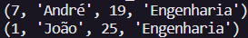

# Exercício da semana 5 - Banco de dados SQL

Neste exercício, trabalhei com a criação de tabelas, inserção de dados, consultas básicas, atualização, remoção, uso de funções agregadas e junção de tabelas em um banco de dados relacional. 

## Passo a passo do exercício:

- A. Crie uma tabela chamada "alunos" com os seguintes campos: id (inteiro), nome (texto), idade (inteiro) e curso (texto).
     
- B. Insira pelo menos 5 registros de alunos na tabela que você criou no exercício anterior.

     
- C. Consultas Básicas
  - Escreva consultas SQL para realizar as seguintes tarefas:
     - Selecionar todos os registros da tabela "alunos".

     - Selecionar o nome e a idade dos alunos com mais de 20 anos.

     - Selecionar os alunos do curso de "Engenharia" em ordem alfabética.

     - Contar o número total de alunos na tabela

       
- D. Atualização e Remoção
  - Atualize a idade de um aluno específico na tabela.

  - Remova um aluno pelo seu ID.
    
- E. Criar uma Tabela e Inserir Dados
  - Crie uma tabela chamada "clientes" com os campos: id (chave primária), nome (texto), idade (inteiro) e saldo (float).
  - Insira alguns registros de clientes na tabela.

    
- F. Consultas e Funções Agregadas
     Escreva consultas SQL para realizar as seguintes tarefas:
     - Selecione o nome e a idade dos clientes com idade superior a 30 anos.

     - Calcule o saldo médio dos clientes.

     - Encontre o cliente com o saldo máximo.

     - Conte quantos clientes têm saldo acima de 1000.

       
- G. Atualização e Remoção com Condições
  - Atualize o saldo de um cliente específico.

  - Remova um cliente pelo seu ID.
    
- H. Junção de Tabelas
  - Crie uma segunda tabela chamada "compras" com os campos: id (chave primária), cliente_id (chave estrangeira referenciando o id da tabela "clientes"), produto (texto) e valor (real).
    Insira algumas compras associadas a clientes existentes na tabela "clientes".Escreva uma consulta para exibir o nome do cliente, o produto e ovalor de cada compra.

- Criando a tabela:

- Consultando a tabela e exibindo o nome do cliente, o produto e ovalor de cada compra:
  
